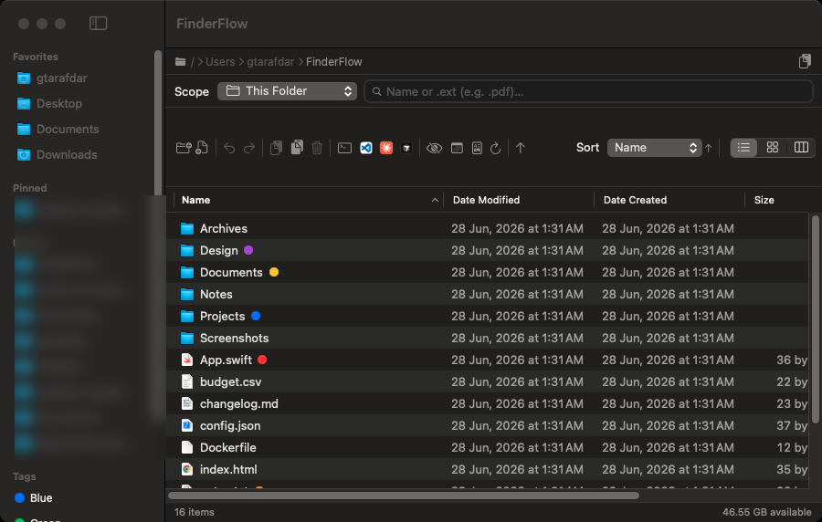
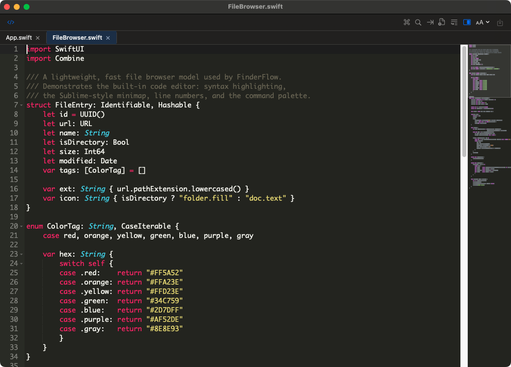
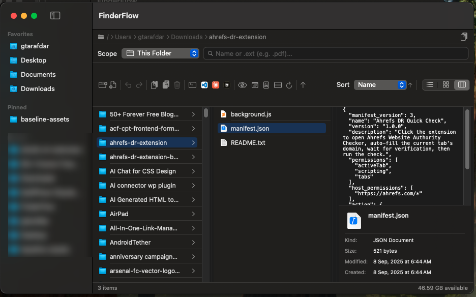
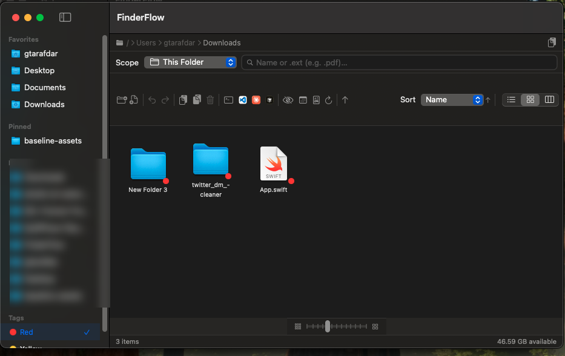
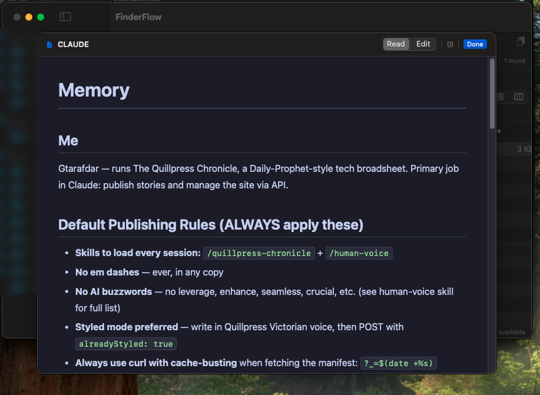
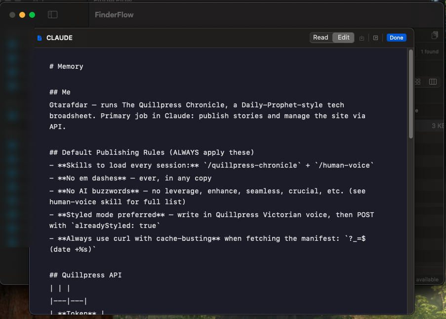

<div align="center">


# aiFlow

**The Mac file manager Finder should have shipped.**

A fast, native macOS file browser with a built-in code editor, a Markdown
reader, real Finder-compatible color tags, Spotlight search, archive tools,
an AI organizer that renames and sorts files by content, secure share links
sent straight from your Mac, and
one-click "open in Terminal / VS Code / Cursor / Claude Code / Codex" — in one
self-contained app that runs entirely on your Mac.


[](LICENSE)

**[⬇ Download the latest release](../../releases/latest)** ·
**[⭐ Star](../../stargazers)**

`macOS 14+` · `Apple Silicon` · `≈ 27 MB` · `Free & open source (MIT)`

</div>

---

## What it is

aiFlow is a **drop-in alternative to the macOS Finder** for people who live
in their files all day — developers, writers, designers, and anyone who has ever
wished Finder did *more*. It keeps everything you like about Finder (column /
list / icon views, Quick Look, tags, the sidebar) and adds the things you
normally reach for three other apps to get.

It's **one download, fully self-contained** — no Homebrew, no Node, no runtimes,
no plugins. Everything runs locally on your Mac by default. There is **no telemetry and no required cloud account**. Networking happens only
when you explicitly enable or use a connected feature: AI Organizer (OpenRouter), Send to
Discord, Check for Updates (GitHub Releases), or configured Secure Share (including its optional background agent).

|  Browse, tag & search  |  Edit code — built in  |
| :---: | :---: |
|  |  |
| Color tags, Spotlight search, sortable columns, copy-path | Tabs, syntax highlighting, command palette, Sublime-style minimap |
|  Column view + preview  |  Icon view + color tags  |
|  |  |
| Miller columns with a live preview & Get Info pane | Resizable icon grid; tap a tag to filter Mac-wide |
|  Markdown — read mode  |  Markdown — edit mode  |
|  |  |
| Rendered preview (no Obsidian needed) | Edit & save with ⌘S, auto-save on close |

---

## Why you'll want it — things macOS Finder can't do

These are the headline reasons people switch. **None of them ship in Finder.**

- **🤖 AI Organizer — rename & sort by content.** Select messy files, hit ✨
  (or File → Organize with AI… ⌥⌘O), review the plan, apply. One ⌘Z undoes
  the whole run. Free `:free` models available — see [AI features](#-ai-features--how-to-use).
- **🔗 Share a document straight from your Mac.** Right-click any file →
  Share → Create Secure Link → send the HTTPS link. Expiration, passwords,
  preview/download permissions included — see [Share from your Mac](#-share-a-document-from-your-mac).
- **📝 A real code editor, built in.** Double-click any text or code file and it
  opens in a proper editor — tabs, syntax highlighting for dozens of languages, a
  fuzzy **command palette (⌘⇧P)**, Sublime keybindings, and a **Sublime-style
  minimap**. You don't need to install Sublime Text or VS Code just to make a
  quick edit.
- **📖 A Markdown reader *and* editor.** Open `.md` files into a clean rendered
  view (great for AI-generated / README / notes files) — or flip to edit mode and
  save with ⌘S. **No Obsidian or separate Markdown app required.**
- **👀 Real preview for popular file types.** Built on the same Quick Look engine
  Finder uses — images, PDFs, code, video, audio, docs — right inside the column
  preview pane and with the Space bar.
- **🖱️ UI-driven file operations.** Cut, copy, paste, **move**, duplicate,
  rename, make alias, compress, extract — all from buttons and right-click menus,
  with full **undo/redo**. No memorizing Terminal commands.
- **🧑‍💻 One-click IDE & terminal launch.** Open the current folder in **Terminal,
  VS Code, Cursor, Claude Code, or Codex** — buttons appear only for the tools you
  actually have installed.
- **🔎 Search that actually finds things.** This folder, this folder + subfolders,
  or **Spotlight-powered across your whole Mac** — including extension search
  (type `.pdf`) — without leaving the window.
- **🔗 Copy a folder's path in one click.** A dedicated copy-path button with a
  confirmation toast. (Try doing *that* quickly in Finder.)
- **🗜️ Archive tools that just work.** Compress to `.zip`; extract
  `.zip / .tar / .gz / .tgz / .bz2 / .xz` using macOS's built-in tools.

> If you've ever opened Finder, then Sublime, then Obsidian, then Terminal just
> to deal with one folder — aiFlow is that whole stack in a single window.

---

## 🤖 AI features — how to use

aiFlow's AI runs through [OpenRouter](https://openrouter.ai) with **your own
key** — no aiFlow account, no subscription. Models ending in `:free` cost
nothing. Everything is **off until you paste a key**, and every AI run shows
you a plan to review **before anything moves**.

**1. One-time setup (2 minutes)**

1. Get a free key at [openrouter.ai/keys](https://openrouter.ai/keys).
2. In aiFlow: **Settings → AI Organizer → paste the key** (stored in the
   macOS Keychain, never in plain files).
3. Pick a model — tap a suggested one, or paste any OpenRouter slug.
   Optional: set a **monthly spend cap**, **reply budget** and **files per
   request**; add **fallback keys** if you want.
4. Done. Without a key, all AI buttons explain themselves instead of failing.

**2. AI Organizer — tidy any folder**

1. Open a messy folder (Downloads, Desktop, an export dump) or select files.
2. Click the **✨ toolbar button** or **File → Organize with AI… (⌥⌘O)**.
3. Hit **Analyze** — the AI suggests better names (by content, not just
   filenames) and subfolders.
4. **Review the plan** (accept / change per file), then **Apply**.
5. Changed your mind? One **⌘Z undoes the whole run**.

**3. Folder Rules — auto-sort new files, with optional AI**

1. Right-click any folder → **Set Up Folder Rules…**.
2. Write the rule in plain words ("invoices go to Invoices", "zips older
   than 30 days to Trash") or build it step by step.
3. Rules with free phrasing or *"AI thinks it is …"* conditions need the AI
   switch: **Settings ▸ Folder Rules → AI on** (off by default, daily limit
   applies and spending counts toward the AI Organizer monthly cap).
4. Watched folders sort new arrivals automatically; every move is logged
   with **Undo**, and rules never permanently delete — only Trash.

**4. Mail Inbox — file attachments with AI**

- Needs the same OpenRouter key (**Settings ▸ AI Organizer**).
- Only attachment names and extracted text go to the model — mail bodies
  and addresses never leave your Mac. Files move only for mails still
  waiting in the Inbox, after your review.

> Privacy: filenames of the files you choose go to OpenRouter with your key
> when you press Analyze/Apply. Browsing, search and file operations never
> touch the network.

---

## Everything it does

<details open>
<summary><b>Browsing & navigation</b></summary>

- **Three views** — **Column** (miller columns with a live preview
  pane + optional ancestor "tree" mode), **List** (sortable by Name, Date
  Modified, Date Created, Size, Kind, Extension, with optional *Group by Date*),
  and **Icon** (resizable 32–128 pt grid).
- **Sidebar** — system locations, your **pinned** folders, **recent** folders,
  and a **Tags** section.
- **Path bar** — clickable breadcrumbs, double-click to type a path, one-click
  **Copy Path**.
- **Status bar** — item count, selection size, free disk space.
- **Quick Look** (Space) + a built-in preview panel.
</details>

<details>
<summary><b>Google Drive — native, without the Drive app</b></summary>

- **Connect one or more Google accounts** (OAuth 2.0 loopback + PKCE, your own
  client ID, refresh tokens in the login Keychain) — no Google Drive for Desktop
  needed, no embedded secret.
- **Local mirror per account** in Application Support,
  browsed like any other folder: double-click, Quick Look, editor, search, tags
  and archives all work on real files.
- **Two-way sync, conservative by design** — downloads new/changed files,
  uploads new/edited local ones, and **never deletes anything automatically**
  (vanished files are counted as *orphaned* for review).
- **Google Docs/Sheets/Slides export** to `.docx` / `.xlsx` / `.pptx` locally;
  double-click opens the live web original, ⌥-double-click the local copy.
- **Drive badges** in list / table / icon views (synced · Google doc · shortcut ·
  waiting to upload) plus a status line with an *Open in Drive* link in the
  preview panel.
- **Drive for Desktop folders still work** — they appear in the same sidebar
  section, and `.gdoc`/`.gsheet` shortcuts open in the browser instead of
  showing raw JSON.
- Setup and details: [docs/google-drive.md](docs/google-drive.md).
</details>

<details>
<summary><b>Finder-compatible color tags</b></summary>

- Add/remove the 7 standard macOS colors from any view's right-click **Tags**
  menu — toggles exactly like Finder, multiple colors per file preserved.
- Written in macOS's real tag format, so they **also show up in Finder**.
- Tag dots render in list / icon / column / preview; tapping a tag in the sidebar
  filters **Mac-wide** via Spotlight.
</details>

<details>
<summary><b>File operations (with Undo/Redo)</b></summary>

- Copy / Cut / Paste, Duplicate, inline Rename, Make Alias (symlink).
- Move to Trash and **Delete Permanently** (confirmed).
- **Compress** to `.zip`; **Extract** common archive formats.
- Share / AirDrop, Show in Finder, Get Info, Copy Path.
- Multi-select aware; partial-failure-safe paste/move with correct undo.
</details>

<details>
<summary><b>Built-in code editor (bundled & offline)</b></summary>

- Double-click a text/code file to edit it in aiFlow.
- Syntax highlighting for dozens of languages; **multiple files as tabs**.
- **Fuzzy command palette (⌘⇧P)**, settings menu, Sublime keybindings.
- **Sublime-style minimap** (theme-aware, click/drag to scroll).
- Runs in a **real, standalone macOS window** — drag, minimize, resize, fit —
  and never blocks the main browser window.
</details>

<details>
<summary><b>Markdown reader / editor</b></summary>

- Rendered preview (GitHub/Obsidian-style, dark + light) with internal `.md`
  link navigation, plus an **Edit** mode with ⌘S save and auto-save on close.
</details>

<details>
<summary><b>E-Sign — sign PDFs and scans</b></summary>

- **Sign…** everywhere a file action lives: right-click (also with several
  files selected), the selection bar's signature button, the preview panel,
  **File ▸ Sign Document…** (⌥⌘E) and Finder ▸ Services — for PDFs, images and
  Word / RTF / ODT documents. Each document opens in its own signing window.
- **Reusable signatures** — draw with the trackpad or mouse (smooth,
  speed-sensitive ink), type your
  name in a script face, or import a photo/scan of your handwritten signature
  (the paper is removed automatically).
- **Place anywhere** — drag to move, corner handle to resize, ⌫ or the red ×
  to remove; add **Date**, **Name**, free **Text** and **✓**; right-click ▸
  *Place on Every Page* for initials. Works on rotated pages too.
- **Signed copy, never the original** — saved as `Name (signed).pdf` next to
  it, the signature burned into the page as vector art. Filled-in forms are
  flattened; links, bookmarks, metadata and page rotation are kept. Photos and
  scans become a one-page PDF, Word / RTF / ODT documents are laid out and
  printed to PDF first (check the pages — page breaks and headers aren't carried
  over); password-protected PDFs can be unlocked and signed.
- **Optional tamper-evident seal** — an Ed25519 signature over the finished
  file's SHA-256, made with a key that lives only on this Mac. Right-click ▸
  **Verify Signature** shows who sealed it, when, and whether it changed since.
  A simple integrity check — not a certificate-based (qualified) e-signature.
- **In Finder too** — right-click ▸ Services ▸ **Sign with aiFlow** /
  **Verify E-Signature with aiFlow**.
</details>

<details>
<summary><b>Search</b></summary>

- Scopes: This Folder, This Folder & Subfolders, Desktop, Documents, Downloads,
  Home, and **Entire Mac** (Spotlight).
- Name and **extension** search; live count; runs in the background.
</details>

<details>
<summary><b>System integration</b></summary>

- **Finder Sync extension** — right-click in Finder: New Folder Here, Copy Path,
  Open in Terminal, **Open in aiFlow**.
- **Set aiFlow as your default folder handler** (Settings) — routes folder
  opens to aiFlow via LaunchServices.
- Custom URL scheme + "Open With" for folders & text files.
- **Launch at Login** toggle, in-app toast notifications.
</details>

---

## 🔗 Share a document from your Mac

Send any file on your Mac as a secure HTTPS link — no cloud upload, no
account, no server setup. The file stays on your Mac and is served through
a temporary Cloudflare tunnel while this Mac is awake and online.

**How to share in seconds**

1. Right-click one file → **Share → Create Secure Link…**.
2. Set **expiration**, an optional **password**, **preview vs. download**
   permission and a **session download limit**.
3. Click Create, **copy the link** and send it — the recipient opens it in
   any browser, no app needed.
4. Manage everything under **Shared Files** (sidebar + File menu): see
   activity, **revoke** a link anytime, or let it expire on its own.

**Good to know**

- Works while this Mac is **awake and online** — after a tunnel restart,
  just copy and send the fresh link.
- An optional embedded **login agent** keeps sharing alive even after the
  app quits (macOS may ask for Login Items approval once).
- Transport-encrypted via Cloudflare (not end-to-end); Quick Tunnels carry
  no uptime guarantee. A self-hosted managed server remains an optional
  alternative.
- [Setup, deployment, privacy and verification](docs/secure-sharing.md).

## Security & privacy

aiFlow touches your files, so it's built to earn that trust — and it was put
through a **senior-QA and security pass** before release.

- **Local by default. No telemetry, no accounts.** Browsing, editing, search and
  file operations never leave your Mac. Outbound connections happen only for
  opt-in features you trigger: AI Organizer (OpenRouter), Send to Discord, and
  update checks (GitHub Releases), and explicitly enabled Secure Share. Secure Share sends only selected file snapshots through the configured relay. Nothing about your files is sent anywhere
  otherwise.
- **Security-reviewed.** An **AppleScript-injection** path (via crafted
  filenames in *Get Info* / *Open in Terminal*) was found and fixed with strict
  string-literal escaping, and the same hardening was applied to the Finder
  extension. The shell/AppleScript bridges were audited end-to-end.
- **Bug-hardened.** The QA pass also fixed a dead keyboard command, unsaved
  Markdown data-loss on close, and made partial paste/move failures undo-safe —
  so you don't lose work.
- **Sandboxed where it matters.** The Finder extension runs **sandboxed**; the
  main app is not sandboxed because a file manager needs full file-system access
  (the same reason Finder isn't). It only uses the access *you* grant via standard
  macOS prompts.
- **E-Sign stays on your Mac.** Saved signatures and the seal key live in
  Application Support (the key file is
  readable only by you); signing and verification never touch the network.
- **Open source.** Read every line. MIT licensed.

## Light on RAM — a file manager, not a memory hog

A file manager should disappear into the background, not sit in Activity Monitor
eating your RAM:

- **≈ 55–60 MB idle** while browsing — measured, not guessed.
- File-type icons are **cached, not duplicated**, so big folders stay lean.
- The code editor and Markdown preview use embedded web tech (WebKit) **only
  while open**, and that memory is **released the moment you close the window**.
- Event-driven — it isn't polling the disk or burning CPU in the background.

---

## Requirements

| **macOS**    | 14.0 Sonoma or later                       |
| ------------ | ------------------------------------------ |
| **Chip**     | Apple Silicon (M1 or newer); Intel needs an Xcode build |
| **Download** | ≈ 27 MB · `.dmg` (includes the Cloudflare helper for Secure Share) |
| **Extras**   | None — fully self-contained                |
| **Price**    | Free & open source (MIT)                   |

## Install

1. Download the latest **`.dmg`** from
   [**Releases**](../../releases/latest) and open it.
2. Drag **aiFlow** into **Applications**.
3. **First launch (one-time Gatekeeper step).** aiFlow is free and isn't
   signed with a paid Apple Developer certificate, so macOS asks once — this is
   expected and safe:
   - Try to open it (it may be blocked), then go to **System Settings → Privacy &
     Security**, scroll to *"aiFlow was blocked"* and click **Open Anyway**.
   - **Or** double-click **Fix Gatekeeper.command** in the DMG (after the app is
     in Applications).
   - **Or** run once in Terminal:
     ```sh
     xattr -dr com.apple.quarantine /Applications/aiFlow.app
     ```
4. *(Optional)* Enable the Finder right-click menu under **System Settings →
   General → Login Items & Extensions → Extensions → aiFlow** (Xcode builds only).

The first time you browse Desktop/Documents/Downloads (or use Get Info / Open in
Terminal), macOS shows its **standard permission prompts** — just click **Allow**.
These are normal for any file manager.

## Build from source

Requires Xcode 16 / Swift 5.9+.

```sh
git clone https://github.com/nnikolaandric-sudo/aiFlow.git
cd aiFlow
open aiFlow.xcodeproj          # build & run with Xcode (⌘R)
./build-local.sh               # or without Xcode: Command Line Tools only
```

Produce a distributable DMG (+ `.sha256` — upload both, the updater needs it):

```sh
./release.sh                                    # Xcode: Universal + Finder extension
./release.sh --prebuilt build/local/aiFlow.app  # no Xcode: Apple Silicon only
```

> Full capability list & development history: **[CHANGELOG.md](CHANGELOG.md)**.

---

## Support this project

If aiFlow saves you a few trips to Finder, here's how to help — optional,
appreciated:

- ⭐ **[Star it on GitHub](../../stargazers)** — helps others find it.

## Notes on distribution

This app is **ad-hoc signed and not notarized** (no paid Apple Developer
account), which is why the one-time Gatekeeper step is needed. To ship it without
that prompt, sign with a Developer ID certificate and notarize.

## Security & updates

In-app updates are optional and can be turned off in **Settings → Updates**.

**Where updates come from**

- Only from official **GitHub Releases** on this repo — hardcoded in the app, not user-configurable.
- Downloads use **HTTPS** (GitHub’s TLS).

**Integrity check**

- Every release ships a companion `aiFlow-x.y.z.dmg.sha256` file (standard
  `shasum` format).
- Before installing, the app **verifies the DMG’s SHA-256 hash** against that file.
- If the checksum is missing or doesn’t match, the update is **blocked**.

**Install helper**

- The DMG’s `Fix Gatekeeper.command` only runs
  `xattr -dr com.apple.quarantine /Applications/aiFlow.app` and opens the app.
  It does not use the network or request admin rights.

**What this means for you**

- Same trust model as downloading the DMG manually from GitHub — you trust the
  maintainer’s releases.
- A public repo does **not** weaken security; the updater uses read-only APIs and
  ships no secrets.
- Auto-update makes a compromised release reach users faster — protect your
  GitHub account with **2FA** and only publish releases you built yourself.

**What we don’t verify (yet)**

- Apple Developer ID signatures or notarization (requires a paid Apple account).
- For maximum assurance, compare the published SHA-256 on the release page with
  a hash you compute locally: `shasum -a 256 aiFlow-x.y.z.dmg`.

## License

MIT — see [LICENSE](LICENSE).

Third-party notices are kept with the source files they apply to.

---

*aiFlow is an independent project and is not affiliated with Apple. Finder is
a trademark of Apple Inc.*
